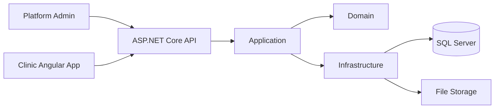

# System Architecture
AURAN Clinic V1 is a modular monolith backed by one SQL Server schema. Logical boundaries are Platform Foundation and Clinic Workspace. Clinic records use `ClinicId`; Platform records/actions are not tenant-role actions.

Backend solution target: `CMMS.Api`, `CMMS.Application`, `CMMS.Domain`, `CMMS.Infrastructure`, plus Unit/Integration test projects. No Shared project is required; shared application models live in the appropriate application namespace/project. Preserve the current repository naming if implementation has already standardized a newer solution name.

Architecture decisions: thin controllers; application use cases own orchestration; domain owns invariants; infrastructure owns EF/Identity/storage; configuration over customer forks; synchronous modular-monolith calls by default.
